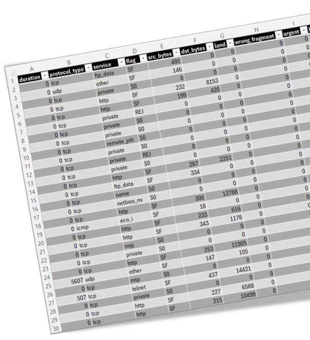

### Détection d’intrusion réseau avec du Machine Learning

> :school: **Lieu de formation :** Université Paris Cité, Campus Grands Moulins (ex-Paris Diderot)
> 
> :books: **UE :** Fouille de Données et Aide à la Décision
> 
> :pushpin: **Année scolaire :** M2
> 
> :calendar: **Dates :** Décembre 2022

#### Description
Objectifs du projet: Utiliser l’apprentissage automatique pour découvrir des corrélations entre les données du réseau 
(le jeu de données choisi est [Network Intrusion Detection](https://www.kaggle.com/datasets/sampadab17/network-intrusion-detection)), 
classification du trafic réseau, découvrir les attaquants à l’intérieur du réseau.

#### Travail effectué
- Exploration des données

- Prétraitement des données (One-hot encoding, Label Encoding, suppression des colonnes inutiles, etc)

- Apprentissage supervisé : Naive bayes, Les K plus proches voisins, Arbres de décision, Forêts aléatoires, Support vector machine, Régression logistique

#### Ressources supplémentaires
- [Slides de la soutenance du projet](Slides.pdf)
